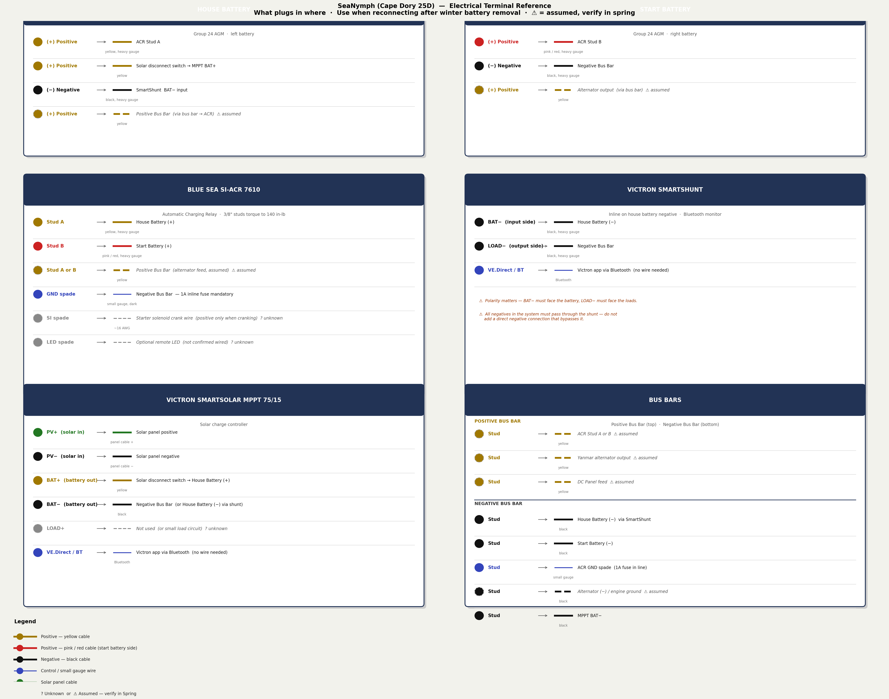

# Electrical Terminal Reference — SeaNymph

**Use this when reconnecting after winter battery removal.** One card per device — shows every terminal and what wire goes there. Dashed / ⚠ items are assumed and should be verified in spring.

> To regenerate: run `python3 generate_terminal_reference.py` from the SeaNymph/ root directory.

## Quick Reconnection Order

Reconnect in this order to avoid shorts and confusion:

1. **Negative Bus Bar first** — connect all negative/ground wires before any positives
2. **SmartShunt** — BAT− side to house battery (−), LOAD− side to negative bus bar
3. **Start Battery (−)** → Negative Bus Bar
4. **ACR GND spade** → Negative Bus Bar (check 1A fuse is in line)
5. **ACR Stud A** → House Battery (+)  (yellow, heavy gauge)
6. **ACR Stud B** → Start Battery (+)  (pink/red, heavy gauge)
7. **Solar disconnect switch** — leave OFF until everything else is connected
8. **MPPT BAT+/BAT−** → House Battery (+)/(−) via switch and shunt
9. **Enable solar disconnect switch** — MPPT will begin charging
10. **Verify ACR LED** — should be OFF (isolated) at rest, ON (combined) when charging

## Critical Reminders

- **SmartShunt polarity:** BAT− faces the battery, LOAD− faces the loads. Getting this backwards damages the shunt.
- **ACR GND fuse:** Must be **1A** — do not substitute a larger fuse.
- **ACR SI terminal:** If a wire is present, confirm it goes to a crank-only circuit (positive only while cranking, not while engine runs). Wrong wiring here prevents the house bank from ever charging off the alternator.
- **Stud torque:** ACR Studs A & B must be torqued to **140 in-lb (15.8 Nm)** — use a torque wrench.
- **All negatives through the SmartShunt:** Do not add any direct negative connection that bypasses the shunt or it will give wrong readings.

## See Also

- [[wiring-diagram]] — topology diagram showing the full system
- [[battery-management]] — ACR logic, LED diagnostics, combine/isolate thresholds
- [[electrical-system]] — SeaNymph cable color code
