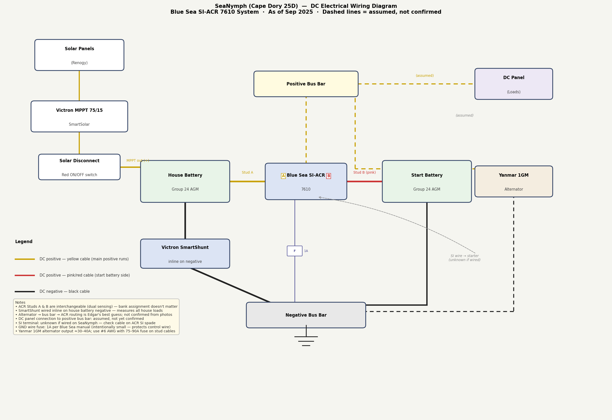

# DC Wiring Diagram — SeaNymph

As-built wiring diagram for SeaNymph's 12V DC system. Generated from photos and the Blue Sea SI-ACR 7610 installation manual. **Dashed lines are assumed — not confirmed from photos.**

> To regenerate: run `python3 generate_wiring_diagram.py` from the SeaNymph/ root directory.

## What's Confirmed

- **House Battery** → ACR Stud A (yellow cable)
- **Start Battery** → ACR Stud B (pink/red cable)
- **MPPT output** → solar disconnect switch → **House Battery** positive (directly)
- **Victron SmartShunt** is wired inline on the house battery negative
- **Blue Sea SI-ACR 7610** is physically installed in the battery compartment
- **Yellow = positive** throughout SeaNymph's DC system; **black = negative**

## What's Assumed (Needs Verification in Spring)

| Connection | Assumption | How to verify |
|---|---|---|
| Alternator → Positive Bus Bar → ACR | Assumed routing | Trace the alternator output wire from the Yanmar |
| DC Panel → Positive Bus Bar | Assumed | Trace the panel feed wire back to source |
| SI terminal | Unknown if wired | Check for a small wire on the ACR's SI spade connector |
| ACR GND fuse rating | Should be 1A per Blue Sea spec | Check the inline fuse on the GND spade wire |

## Spring Commissioning Checklist

Before connecting batteries in spring, verify:

- [ ] ACR GND wire has a **1A inline fuse** (not a larger fuse)
- [ ] SI wire (if present) goes to a circuit that is **positive only when cranking** — not ignition-run
- [ ] All stud connections are torqued to **140 in-lb (15.8 Nm)**
- [ ] Fuses on Stud A and Stud B cables are within 7" of the battery terminals
- [ ] Positive bus bar connections are tight and corrosion-free
- [ ] SmartShunt wiring is intact (both sides of the shunt bar)
- [ ] Solar disconnect switch is functional before enabling solar

## LED Diagnostics

| LED state | Meaning | Action |
|---|---|---|
| Solid ON | Batteries combined — charging | Normal |
| OFF | Batteries isolated — standby | Normal |
| Slow flash | Start isolation active (cranking) | Normal during cranking only |
| Fast flash | Under voltage lockout | Check battery voltage; one bank below 9.5V? |
| Fast flash while running | SI wire fault | SI wire is connected to ignition-run, not crank-only |

## See Also

- [[battery-management]]
- [[batteries]]
- [[solar-system]]
- [[electrical-system]]
- [[src-blue-sea-acr-manual]]
